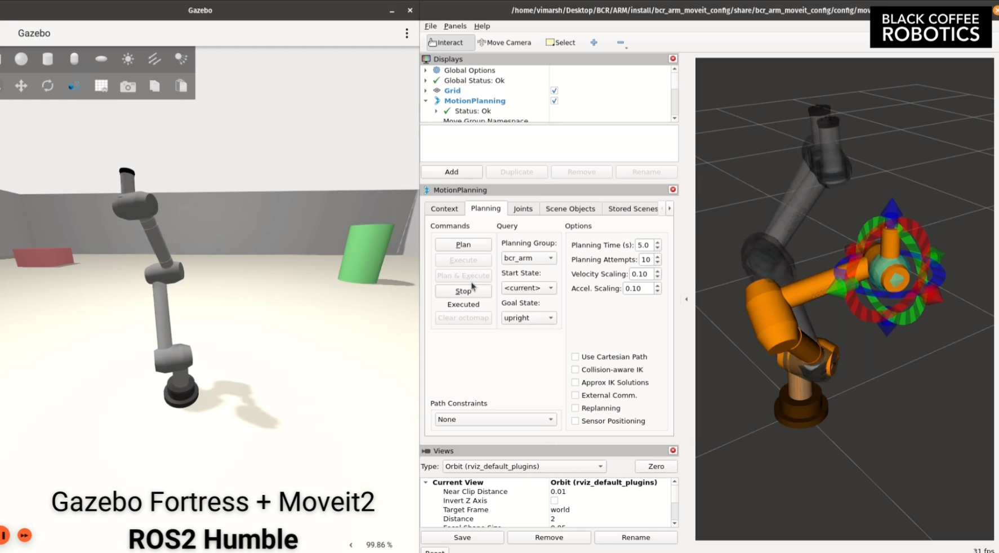

# BCR Arm

Custom ROS 2 / Gazebo workspace for the Black Coffee Robotics 7-DOF arm, with the main workflow centered on our custom damped least squares (DLS) inverse kinematics solver.



## What This Repo Focuses On

This workspace is primarily used to:

- launch the BCR arm in Gazebo with `ros2_control`
- initialize the arm in a repeatable setup pose
- drive the arm from Cartesian targets using our custom solver in `bcr_arm_gazebo/scripts/dls_ik_executor.py`
- visualize target points in Gazebo
- run repeatable Cartesian test sequences

The repo also contains MoveIt and Isaac Sim assets, but this README is intentionally focused on the custom solver workflow we use for development and testing.

## Relevant Packages

- `bcr_arm_description`: URDF, meshes, RViz configs, and robot description assets
- `bcr_arm_gazebo`: Gazebo launch files, worlds, and custom control / IK scripts
- `bcr_arm_moveit_config`: MoveIt configuration for the arm
- `bcr_arm`: metapackage for the stack

## Prerequisites

Recommended environment:

- Ubuntu 22.04
- ROS 2 Humble
- Gazebo Fortress

Install the base tools:

```bash
sudo apt update
sudo apt install -y \
  ros-humble-desktop \
  gz-fortress \
  python3-colcon-common-extensions \
  python3-rosdep
```

If `rosdep` has not been initialized yet:

```bash
sudo rosdep init
rosdep update
```

## Build

These commands assume this repository itself is your colcon workspace root.

```bash
cd ~/openRobotics/bcr_arm
source /opt/ros/humble/setup.bash
rosdep install --from-paths . --ignore-src -r -y
colcon build --symlink-install
source install/setup.bash
```

## Custom Solver Workflow

Open a separate terminal for each step below.

TODO: Simplify by creating a single launch file.

### Terminal 1: Launch Gazebo

```bash
cd ~/openRobotics/bcr_arm
source /opt/ros/humble/setup.bash
source install/setup.bash
ros2 launch bcr_arm_gazebo bcr_arm.gazebo.launch.py
```

### Terminal 2: Send the Setup Pose Once

This sends the arm to the default `neutral_carry` pose, which is the recommended starting point for solver tests.

```bash
cd ~/openRobotics/bcr_arm
source /opt/ros/humble/setup.bash
source install/setup.bash
ros2 run bcr_arm_gazebo setup_arm_pose.py
```

Optional named poses:

```bash
ros2 run bcr_arm_gazebo setup_arm_pose.py --pose home
ros2 run bcr_arm_gazebo setup_arm_pose.py --pose neutral_carry_yaw_left
ros2 run bcr_arm_gazebo setup_arm_pose.py --pose neutral_carry_yaw_right
```

### Terminal 3: Visualize Cartesian Targets

This node creates and moves a visible marker in Gazebo so the commanded target is easy to inspect.

```bash
cd ~/openRobotics/bcr_arm
source /opt/ros/humble/setup.bash
source install/setup.bash
ros2 run bcr_arm_gazebo cartesian_target_marker.py --ros-args -p marker_radius:=0.025
```

### Terminal 4: Start the Custom DLS IK Executor

```bash
cd ~/openRobotics/bcr_arm
source /opt/ros/humble/setup.bash
source install/setup.bash
ros2 run bcr_arm_gazebo dls_ik_executor.py
```

### Terminal 5: Publish Targets

You can either publish a one-off Cartesian point:

```bash
cd ~/openRobotics/bcr_arm
source /opt/ros/humble/setup.bash
source install/setup.bash
ros2 topic pub --once /cartesian_target geometry_msgs/msg/PointStamped \
'{header: {frame_id: world}, point: {x: -0.10, y: 0.40, z: 0.25}}'
```

Or run the repeatable target sequence:

```bash
source /opt/ros/humble/setup.bash
source ~/openRobotics/bcr_arm/install/setup.bash
ros2 run bcr_arm_gazebo cartesian_target_test_suite.py
```

## What Each Custom Node Does

### `setup_arm_pose.py`

Sends a one-shot joint trajectory to move the robot into a known setup pose before testing.

### `dls_ik_executor.py`

Our custom IK node:

- subscribes to `/cartesian_target` as `geometry_msgs/msg/PointStamped`
- subscribes to `/cartesian_target_pose` as `geometry_msgs/msg/PoseStamped`
- reads the current state from `/joint_states`
- solves IK numerically from the current joint configuration
- publishes the solved command to `/joint_trajectory_controller/joint_trajectory`

### `cartesian_target_marker.py`

Creates and updates a red Gazebo marker at the active target position.

### `cartesian_target_test_suite.py`

Publishes a staged target sequence for repeatable solver testing and pauses between steps for manual inspection.

## Solver Notes

The custom solver in `dls_ik_executor.py` uses:

- damped least squares updates
- a forward kinematics and Jacobian model defined directly in the node
- weighted position and orientation error terms
- joint limit clipping
- per-step joint and velocity limiting
- optional retry behavior through the neutral carry pose

Point targets and full pose targets are both supported.

For point targets, the solver can be configured to:

- keep the current end-effector orientation
- lock to the neutral orientation
- ignore orientation and solve position only

## Useful Solver Parameters

You can tune the solver at runtime with ROS parameters:

```bash
ros2 run bcr_arm_gazebo dls_ik_executor.py --ros-args \
  -p damping_lambda:=0.08 \
  -p goal_time_sec:=3.0 \
  -p position_tolerance:=0.005 \
  -p orientation_tolerance:=0.06 \
  -p point_target_orientation_policy:=current
```

Common parameters:

- `damping_lambda`
- `goal_time_sec`
- `position_tolerance`
- `orientation_tolerance`
- `step_scale`
- `max_joint_step`
- `max_joint_velocity`
- `solver_max_iterations`
- `point_target_orientation_policy` with `current`, `neutral`, or `none`
- `orientation_mode` with `exact` or `upright_free_yaw`

## Pose Target Example

To send a full Cartesian pose target instead of only a point:

```bash
ros2 topic pub --once /cartesian_target_pose geometry_msgs/msg/PoseStamped \
'{header: {frame_id: world}, pose: {position: {x: -0.10, y: 0.40, z: 0.25}, orientation: {x: 0.0, y: -0.70710678, z: 0.0, w: 0.70710678}}}'
```

You can also send a one-shot target directly through the solver process:

```bash
ros2 run bcr_arm_gazebo dls_ik_executor.py --x -0.10 --y 0.40 --z 0.25
```

Or with an explicit quaternion:

```bash
ros2 run bcr_arm_gazebo dls_ik_executor.py \
  --x -0.10 --y 0.40 --z 0.25 \
  --qx 0.0 --qy -0.70710678 --qz 0.0 --qw 0.70710678
```

## Useful Files

- `bcr_arm_gazebo/scripts/dls_ik_executor.py`
- `bcr_arm_gazebo/scripts/setup_arm_pose.py`
- `bcr_arm_gazebo/scripts/cartesian_target_marker.py`
- `bcr_arm_gazebo/scripts/cartesian_target_test_suite.py`
- `bcr_arm_gazebo/launch/bcr_arm.gazebo.launch.py`
