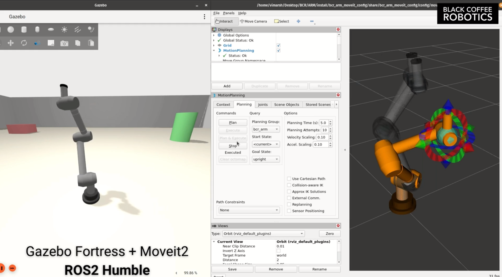

# BCR Arm

Custom ROS 2 workspace for two related manipulation tracks:

- the original Black Coffee Robotics 7-DOF arm in Gazebo
- a 5-DOF RX-150 track for simulation and physical-arm experiments

The main custom work in this repo is centered on damped least squares (DLS) inverse kinematics, Cartesian target testing, and higher-level task experimentation.

**The RX-150 arm is the main, most built-out stack.** It is a full custom pipeline — DLS inverse kinematics, an obstacle-avoiding path planner, a joint-space RRT-Connect whole-body fallback, and sweep-based point-cloud mapping — that runs in both simulation and on the physical arm. For setup and running, use the RX-150 command references:

- **Simulation:** [bcr_arm_rx150/SIM_COMMANDS.md](bcr_arm_rx150/SIM_COMMANDS.md)
- **Hardware:** [bcr_arm_rx150/HARDWARE_COMMANDS.md](bcr_arm_rx150/HARDWARE_COMMANDS.md)



## What This Repo Focuses On

This workspace is primarily used to:

- launch the custom 7-DOF BCR arm in Gazebo
- drive the BCR arm from Cartesian targets using a custom DLS solver
- bring up the RX-150 in both simulation and hardware from within this workspace
- run repeatable Cartesian target tests for both the BCR arm and RX-150
- experiment with motion, perception, and task-level robotics workflows

The repo also contains MoveIt, description, and Isaac-related assets, but this README focuses first on the setups most people will actually launch.

## Relevant Packages

- `bcr_arm_description`: URDF, meshes, RViz configs, and robot description assets
- `bcr_arm_gazebo`: Gazebo launch files, worlds, and custom control / IK scripts
- `bcr_arm_moveit_config`: MoveIt configuration for the arm
- `bcr_arm_rx150`: RX-150 launch files and safe hardware test utilities
- `data_collector`: custom ROS 2 Python nodes for joint-state and point-cloud capture
- `bcr_arm`: metapackage for the stack
- `interbotix`: vendored subset of the Interbotix RX-150 support stack used by the RX-150 sim, control, and MoveIt launches

## Available Setups

This repo currently exposes three main robot setups:

### 1. BCR Arm Gazebo

This is the original custom 7-DOF arm workflow. It uses the repo's Gazebo world, arm model, and original custom DLS IK solver in `bcr_arm_gazebo`.

Use this when the goal is to:

- work on the original BCR arm
- test the 7-DOF custom solver in simulation
- publish Cartesian targets and inspect the result in Gazebo

Primary launch:

```bash
ros2 launch bcr_arm_gazebo bcr_arm.gazebo.launch.py
```

### 2. RX-150 Gazebo

This is the newer 5-DOF RX-150 simulation workflow. It is exposed through `bcr_arm_rx150`, but the simulator itself is a thin wrapper around the upstream Interbotix RX-150 Gazebo Classic stack.

Use this when the goal is to:

- test RX-150-targeted workflows without hardware
- compare custom motion behavior against the physical RX-150 track
- keep all RX-150 launches local to `bcr_arm`

Primary launch (bare Gazebo bringup):

```bash
ros2 launch bcr_arm_rx150 rx150_gz_classic.launch.py
```

**Full sim stack (obstacle planner + RRT-Connect fallback + sweep mapping + RViz viz) and all
setup/run commands:** see **[bcr_arm_rx150/SIM_COMMANDS.md](bcr_arm_rx150/SIM_COMMANDS.md)**.

### 3. RX-150 Hardware

This is the physical 5-DOF RX-150 workflow. It uses this repo for both the project-level scripts and the vendored RX-150 support stack, including the low-level driver, descriptions, and launch infrastructure.

Use this when the goal is to:

- control the real RX-150 from `bcr_arm`
- run safe named poses and smoke tests
- test the custom RX-150 DLS stack on hardware, including the obstacle planner and RRT-Connect
  whole-body fallback

Primary launch (full planning stack; add `minimal:=true` for driver + IK only):

```bash
ros2 launch bcr_arm_rx150 rx150_dls_stack.launch.py
```

`rx150_control.launch.py` brings up just the low-level driver if you need it standalone.

**Full setup/run commands (Docker launch, safe bring-up, driving the stack):** see
**[bcr_arm_rx150/HARDWARE_COMMANDS.md](bcr_arm_rx150/HARDWARE_COMMANDS.md)**.

## Prerequisites

Recommended environment:

- Ubuntu 22.04
- ROS 2 Humble
- Gazebo Fortress for the BCR arm simulation
- Gazebo Classic 11 for the RX-150 Gazebo simulation

Install the base tools:

```bash
sudo apt update
sudo apt install -y \
  ros-humble-desktop \
  gazebo \
  gz-fortress \
  python3-colcon-common-extensions \
  python3-rosdep
```

If `rosdep` has not been initialized yet:

```bash
sudo rosdep init
rosdep update
```

## Build

These commands assume this repository itself is the colcon workspace root.

```bash
cd ~/openRobotics/bcr_arm
source /opt/ros/humble/setup.bash
rosdep install --from-paths . --ignore-src -r -y
colcon build --symlink-install
source install/setup.bash
```

The vendored `interbotix` subtree is included so the RX-150 workflows can build from a fresh clone without requiring a separate `~/interbotix_ws`.

## Docker Support

This repo includes a workspace-level Docker setup for the RX-150 simulation and hardware workflows:

- `workspace`: interactive development shell
- `rx150-sim`: RX-150 Gazebo sim plus the custom DLS solver
- `rx150-hardware`: physical RX-150 plus the custom DLS solver

Support expectations:

- Ubuntu/Linux host: supported for development, RX-150 sim, and RX-150 hardware
- macOS/Windows host: useful for development and limited containerized workflows, but not recommended as the primary path for physical robot or camera access

Important note:

- The Docker setup makes the repo environment reproducible.
- Physical RX-150 use still depends on the host exposing the USB/serial devices correctly.
- The `rx150-hardware` Docker service is intended for Linux hosts.

Build the image:

```bash
cd ~/openRobotics/bcr_arm
docker compose build
```

Open an interactive development shell:

```bash
docker compose run --rm workspace
```

Launch the RX-150 sim stack in Docker:

```bash
xhost +local:docker
docker compose run --rm --service-ports rx150-sim
```

Launch the RX-150 hardware stack in Docker on Linux:

```bash
xhost +local:docker
docker compose run --rm --service-ports rx150-hardware
```

The helper script `bcr-setup-workspace` inside the container runs:

- `rosdep install --from-paths . --ignore-src -r -y`
- `colcon build --packages-up-to bcr_arm_rx150 --symlink-install`

This means the Docker launch services build the RX-150 path before starting the requested stack.

## Optional External Underlay

If an existing Interbotix workspace is already available, it can still be sourced as an underlay. This is optional for the RX-150 path in this repo, not required.

Typical setup:

```bash
source /opt/ros/humble/setup.bash
source ~/interbotix_ws/install/setup.bash
cd ~/openRobotics/bcr_arm
colcon build --symlink-install
source install/setup.bash
```

When both are present, the local vendored packages in this repo are intended to be the project-facing source of truth.

For RX-150 Gazebo Classic simulation, it is also helpful to source Gazebo Classic's setup file:

```bash
source /usr/share/gazebo-11/setup.sh
```

## RX-150 Hardware Workflow

Launch the physical RX-150 driver from this repo:

```bash
cd ~/openRobotics/bcr_arm
source /opt/ros/humble/setup.bash
source install/setup.bash
ros2 launch bcr_arm_rx150 rx150_control.launch.py
```

Send a named pose in another terminal:

```bash
cd ~/openRobotics/bcr_arm
source /opt/ros/humble/setup.bash
source install/setup.bash
ros2 run bcr_arm_rx150 rx150_named_pose --pose neutral_carry
```

Run the small lift-and-return smoke test:

```bash
ros2 run bcr_arm_rx150 rx150_smoke_test
```

Launch the MoveIt interface for the real arm:

```bash
ros2 launch bcr_arm_rx150 rx150_moveit_interface.launch.py
```

Run the custom DLS stack for the physical RX-150:

```bash
ros2 launch bcr_arm_rx150 rx150_dls_stack.launch.py
```

By default this brings up the **full** planning stack on the real arm — the arm driver, the
DLS IK executor (conservative motion, frame `rx150/base_link`), the obstacle **planner**, the
**RRT-Connect** whole-body fallback, both waypoint executors, and the cloud relay. Add
`minimal:=true` for just the driver + IK executor (drive it directly, no planner):

```bash
ros2 launch bcr_arm_rx150 rx150_dls_stack.launch.py minimal:=true
```

The full stack needs a point cloud on `/planning/point_cloud` (from the RealSense + sweep — a
port still in progress), so until the camera is wired use `minimal:=true` or feed a canned
cloud. Targets use frame `rx150/base_link`.

**See [bcr_arm_rx150/HARDWARE_COMMANDS.md](bcr_arm_rx150/HARDWARE_COMMANDS.md)** for the full,
authoritative hardware command reference (Docker launch, named poses, smoke test, targets,
suites, and driving the full planning stack). Quick examples, run against `minimal:=true`:

```bash
ros2 run bcr_arm_rx150 rx150_named_pose --pose neutral_carry
ros2 run bcr_arm_rx150 rx150_smoke_test
ros2 run bcr_arm_rx150 rx150_target_test_suite --suite smoke --ros-args -p world_frame:=rx150/base_link
# suites: smoke (safest), lateral (center/left/right), pose (exact poses), full (all)
ros2 run bcr_arm_rx150 rx150_dls_ik_executor --x 0.22 --y 0.00 --z 0.16 --frame rx150/base_link
```

## RX-150 Gazebo Sim Workflow

Launch the Interbotix RX-150 Gazebo Classic sim from this repo:

```bash
cd ~/openRobotics/bcr_arm
source /opt/ros/humble/setup.bash
source install/setup.bash
ros2 launch bcr_arm_rx150 rx150_gz_classic.launch.py
```

Useful variants:

```bash
ros2 launch bcr_arm_rx150 rx150_gz_classic.launch.py use_rviz:=false
ros2 launch bcr_arm_rx150 rx150_gz_classic.launch.py paused:=true
```

If you want MoveIt on top of RX-150 Gazebo sim, launch the existing wrapper with
`hardware_type:=gz_classic`:

```bash
ros2 launch bcr_arm_rx150 rx150_moveit_interface.launch.py hardware_type:=gz_classic
```

This sim entry point is a thin wrapper around the vendored Interbotix RX-150 sim stack in `interbotix`, so the RX-150 workflow remains locally launchable from `bcr_arm`.

For the **full sim planning stack** (Gazebo world with obstacles + depth camera, the obstacle
planner, the RRT-Connect whole-body fallback, sweep-based mapping, and RViz path
visualization), launch `rx150_dls_sim_stack.launch.py` — see
**[bcr_arm_rx150/SIM_COMMANDS.md](bcr_arm_rx150/SIM_COMMANDS.md)** for the full Docker command
reference (build, launch, sweep, sending targets). The planner, RRT fallback, and executors
are the same nodes that run on the physical arm (see the hardware workflow above).

## BCR Arm 7-DOF Gazebo Workflow

Open a separate terminal for each step below.

TODO: Simplify by creating a single launch file.

### Terminal 1: Launch Gazebo

```bash
cd ~/openRobotics/bcr_arm
source /opt/ros/humble/setup.bash
source install/setup.bash
ros2 launch bcr_arm_gazebo bcr_arm.gazebo.launch.py
```

### Terminal 2: Send the Setup Pose Once

This sends the arm to the default `neutral_carry` pose, which is the recommended starting point for solver tests.

```bash
cd ~/openRobotics/bcr_arm
source /opt/ros/humble/setup.bash
source install/setup.bash
ros2 run bcr_arm_gazebo setup_arm_pose.py
```

Optional named poses:

```bash
ros2 run bcr_arm_gazebo setup_arm_pose.py --pose home
ros2 run bcr_arm_gazebo setup_arm_pose.py --pose neutral_carry_yaw_left
ros2 run bcr_arm_gazebo setup_arm_pose.py --pose neutral_carry_yaw_right
```

### Terminal 3: Visualize Cartesian Targets

This node creates and moves a visible marker in Gazebo so the commanded target is easy to inspect.

```bash
cd ~/openRobotics/bcr_arm
source /opt/ros/humble/setup.bash
source install/setup.bash
ros2 run bcr_arm_gazebo cartesian_target_marker.py --ros-args -p marker_radius:=0.025
```

### Terminal 4: Start the Custom DLS IK Executor

```bash
cd ~/openRobotics/bcr_arm
source /opt/ros/humble/setup.bash
source install/setup.bash
ros2 run bcr_arm_gazebo dls_ik_executor.py
```

### Terminal 5: Publish Targets

You can either publish a one-off Cartesian point:

```bash
cd ~/openRobotics/bcr_arm
source /opt/ros/humble/setup.bash
source install/setup.bash
ros2 topic pub --once /cartesian_target geometry_msgs/msg/PointStamped \
'{header: {frame_id: world}, point: {x: -0.10, y: 0.40, z: 0.25}}'
```

Or run the repeatable target sequence:

```bash
source /opt/ros/humble/setup.bash
source ~/openRobotics/bcr_arm/install/setup.bash
ros2 run bcr_arm_gazebo cartesian_target_test_suite.py
```

## What Each Custom BCR Gazebo Node Does

### `setup_arm_pose.py`

Sends a one-shot joint trajectory to move the robot into a known setup pose before testing.

### `dls_ik_executor.py`

Our custom IK node:

- subscribes to `/cartesian_target` as `geometry_msgs/msg/PointStamped`
- subscribes to `/cartesian_target_pose` as `geometry_msgs/msg/PoseStamped`
- reads the current state from `/joint_states`
- solves IK numerically from the current joint configuration
- publishes the solved command to `/joint_trajectory_controller/joint_trajectory`

### `cartesian_target_marker.py`

Creates and updates a red Gazebo marker at the active target position.

### `cartesian_target_test_suite.py`

Publishes a staged target sequence for repeatable solver testing and pauses between steps for manual inspection.

## Solver Notes

The custom solver in `dls_ik_executor.py` uses:

- damped least squares updates
- a forward kinematics and Jacobian model defined directly in the node
- weighted position and orientation error terms
- joint limit clipping
- per-step joint and velocity limiting
- optional retry behavior through the neutral carry pose

Point targets and full pose targets are both supported.

For point targets, the solver can be configured to:

- keep the current end-effector orientation
- lock to the neutral orientation
- ignore orientation and solve position only

## Useful Solver Parameters

You can tune the solver at runtime with ROS parameters:

```bash
ros2 run bcr_arm_gazebo dls_ik_executor.py --ros-args \
  -p damping_lambda:=0.08 \
  -p goal_time_sec:=3.0 \
  -p position_tolerance:=0.005 \
  -p orientation_tolerance:=0.06 \
  -p point_target_orientation_policy:=current
```

Common parameters:

- `damping_lambda`
- `goal_time_sec`
- `position_tolerance`
- `orientation_tolerance`
- `step_scale`
- `max_joint_step`
- `max_joint_velocity`
- `solver_max_iterations`
- `point_target_orientation_policy` with `current`, `neutral`, or `none`
- `orientation_mode` with `exact` or `upright_free_yaw`

## Pose Target Example

To send a full Cartesian pose target instead of only a point:

```bash
ros2 topic pub --once /cartesian_target_pose geometry_msgs/msg/PoseStamped \
'{header: {frame_id: world}, pose: {position: {x: -0.10, y: 0.40, z: 0.25}, orientation: {x: 0.0, y: -0.70710678, z: 0.0, w: 0.70710678}}}'
```

You can also send a one-shot target directly through the solver process:

```bash
ros2 run bcr_arm_gazebo dls_ik_executor.py --x -0.10 --y 0.40 --z 0.25
```

Or with an explicit quaternion:

```bash
ros2 run bcr_arm_gazebo dls_ik_executor.py \
  --x -0.10 --y 0.40 --z 0.25 \
  --qx 0.0 --qy -0.70710678 --qz 0.0 --qw 0.70710678
```

## Useful Files

- `bcr_arm_gazebo/scripts/dls_ik_executor.py`
- `bcr_arm_gazebo/scripts/setup_arm_pose.py`
- `bcr_arm_gazebo/scripts/cartesian_target_marker.py`
- `bcr_arm_gazebo/scripts/cartesian_target_test_suite.py`
- `bcr_arm_gazebo/launch/bcr_arm.gazebo.launch.py`
